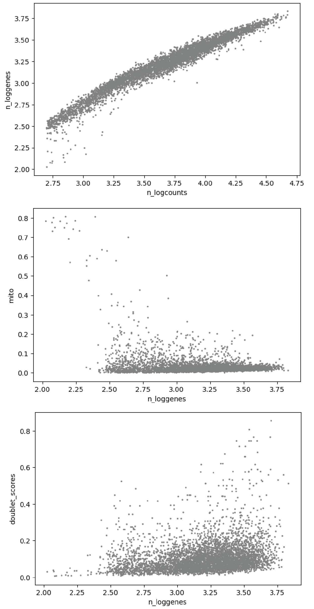
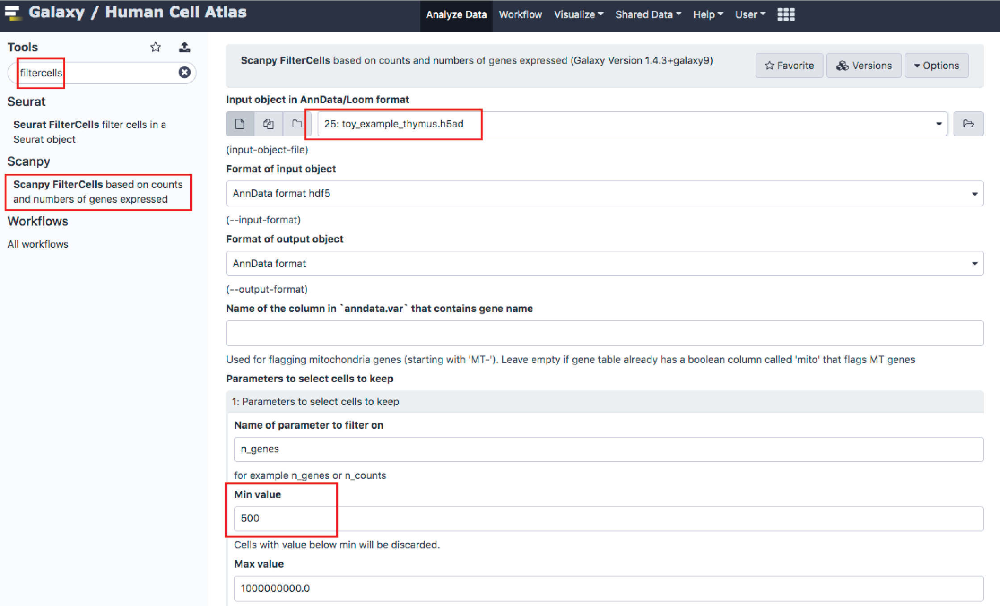
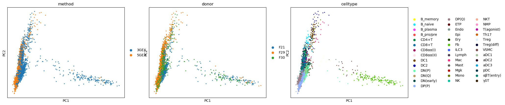
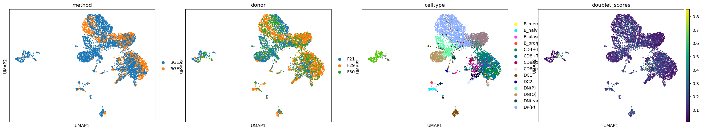

# Preprocessing single-cell data and batch correction

## Objectives

By the end of this short tutorial should you should understand:

 * how to check the quality of single-cell experiment and clean it
 * how to preprocess dataset for analysis (normalisation, log-transform, scaling)
 * how to perform demensionality reduction (PCA, umap) and clustering
 * how to perform batch correction

## Input files required

You will most likely have multiple files from different experiments (like control vs treatment, multiple samples collected from different individuals, or run on different single-cell methods), which needs to be concatenated

 * matrix.mtx, barcodes.tsv, genes.tsv files from alignment tool (star-solo, cellranger, salmon alevin etc)
 
For the sake of time, we will start with toy example (*.h5ad format) which have concatenated multiple single-cell experiment, containing data from several donors and two different 10X single-cell chemistries.

 * adata.h5ad file

# Introduction

In the previous session, you have learned how to generate matrix files from fastq files. This session will guide you to how to check the quality of these matrix files and analyse them. This includes: checking the quality of the generated matrix files, preprecessing the data for analysis, correcting batch effect and visualising them by clustering. This is most basic workflow that you will run in any single-cell data analysis.

There are many packages, which have collection of functions for running this workflow. Such as [Seurat](https://satijalab.org/seurat/), [Scanpy](https://icb-scanpy.readthedocs-hosted.com/en/stable/), [Monocle3](https://cole-trapnell-lab.github.io/monocle3/), [Scater](http://bioconductor.org/packages/release/bioc/html/scater.html). They offer streamlined workflow and tutorials that can be easily followed.

Today, we will follow the [scanpy workflow](https://scanpy-tutorials.readthedocs.io/en/latest/pbmc3k.html). Scanpy is python package based on object called [anndata](https://icb-anndata.readthedocs-hosted.com/en/stable/anndata.AnnData.html), which is data storage format made easy to store metadata and processed data from each stages.

We'll be using a setup based on Galaxy to illustrate the process for teaching purposes, but all steps are peformed using commodity tools you could run from the command line if you're more comforable there.

## 1. Example data

The data you will process today is small toy example taken from [human thymus dataset](https://zenodo.org/record/3711134#.XqPKJVNKhrB). This study is good example for batch correction as the data has collected from multiple donors and using two different 10X chemistries (3' v2 chemistry and 5' chemistry).

Down-sampled reads and some associated annotation are provided for you in what Galaxy calls a 'history'. Access the shared history:

If you click through to the history itself, you'll find the 'toy_example_thymus.h5ad' file at the bottom. This file contains concatenated matrix from 5 individual 10X lanes.

Batch | Donor | 10X chemistry
--------------|-------|--------------
1|F21|3'
2|F29|3'
3|F29|5'
4|F30|3'
5|F30|5'

All datasets have been mapped with [cellranger](https://support.10xgenomics.com/single-cell-gene-expression/software/pipelines/latest/what-is-cell-ranger), which is alignment tool provided by 10X. The resulting count matrix have been loaded using [scanpy.read](https://icb-scanpy.readthedocs-hosted.com/en/stable/api/scanpy.read.html#scanpy.read) function and concatenated into single anndata object (h5ad format).

Metadata contains following contents:

 * donor: human donor ID
 * method: 10X chemistry used. 5GEX (10X 5') and 3GEX (10X 3' v2)
 * batch: donor x method

For general QC, we have calculated some basic features, which are as following:

 * n_genes: number of total genes detected per cell
 * n_loggenes: log10(n_genes)
 * n_counts: number of total UMI counts per cell
 * n_logcounts: log10(n_counts)
 * mito: fraction of total UMI counts assigned to mitochondrial genes to total UMI counts
 * doublet_scores: doublet score calculated by [scrublet](https://github.com/AllonKleinLab/scrublet) [(Wolock 2019)](https://www.cell.com/cell-systems/pdfExtended/S2405-4712(18)30474-5)
 
The dataset also contains cell type annotation, which was taken from thymus cell atlas, to aid visualistion of batch effect

 * celltype

## 2. The workflow

### 1. Checking the quality of data

So, we have data that has just come out from mapping pipeline. Now we need to check whether the run has been successful. There are many steps that can go wrong. Your cells might have died before loading, which would yield low UMI counts from cells and higher background. Sometimes cell counting might have failed, resulting in over-loading. In this case, you will have too many cells and doublets. Thus, it's important to perform general QC for each run. Otherwise, your end result will be deteriorated by these low-quality signals from failed run.

We will start by visualising the distribution of number of genes detected per cell, number of total UMI counts per cell, and fraction of mitochondiral mRNAs.

 1. Search 'plot' from Galaxy search toolbar
 2. From 'Scanpy' package, click 'Plot with scanpy'
 4. Set __Method used for plotting__ as __Generic: Scatter plot along observations or variable axes, using 'pl.scatter'__. 
 5. Set __x- and y- coordinates__ with __'n_logcounts', 'n_loggenes'__ or __'n_loggenes', 'mito'__ or __'n_loggenes', 'doublet_scores'__'''
 

> Q: Which threshold would you use to filter bad cells? 

The plots show distribution of basic QC measures and their relationship. As expected, n_counts and n_genes are proportional. At the same time, you could notice droplets with disproportionally less n_genes compared to n_counts, which also have higher mito fraction. This is often indicative of empty droplet which was mistaken from initial filter and you would want to remove them.

In this dataset, most cells with good gene number coverge (high n_genes) contain less than 20% of mitochondrial mRNA. If you see mitochondrial fraction much higher than this (like 50~80%), this is probably resulting from dying cells.

You can notice high doublet scores for some droplets. You would generally expect ~4% doublet rate if you aimed to recover 5000 cells. Generally, doublets have higher n_genes, as they contain genes from both cell types. But some cells do have more n_genes and other cell in general. So you should be careful about setting doublet filter based on n_genes. (Also, some cells have significanly less n_genes compared to others. So be careful for lower bound filters too!)

Scatter plot is good to compare relationship between QC measures. However, it is often difficult to compare distributions across multiple samples. For this purpose, let's draw some violin plots. You can simply change the step 4 and step 5 from above to:

 4. Set __Method used for plotting__ as __Generic: Violin plot, using 'pl.violin'__.
 5. Set __Keys for accessing variables__ as __Subset of variables in 'adata.var_names' or fields of '.obs'__ and provide comma separte list of __n_loggenes,n_logcounts,mito__. Also, set __The key of the observation grouping to consider__ as __batch__.

> Q: Which sample has the lowest coverage? Are there any difference between 10X chemistries?

### 2. Filter cells based on QC metrics.

After visual inspection, We have come up with following conclusion: _Let's remove any droplets with less than 500 n_genes, 1000 n_counts, or higher than 0.2 mito fraction_. This can be simply achieved by built in function in scanpy called __filter_cells__. We will also remove genes that are not expressed in this dataset, by taking genes which are detected in at least 3 cells. There's another function for this, which is called __filter_genes__.

 1. Go to 'Tools' and within 'Scanpy' package, click 'filter_cells' or 'filter_genes'
 2. Set up consecutive filters. Set __parameters to select genes (cells) to keep__ in __Details__ as suggested above.
 3. Check for the dimension of AnnData object (n_obs x n_vars) by clicking the result from each step.
 

> Q: How many cells and genes have been filtered?

### 3. Normalisation and log-transformation

Now we have matrix that is left with good quality cells and expressed genes. Next step in pipeline is normalising your data. As you have seen in the plot above, the detected cells have dynamic range of coverage, detected in variation in __n_genes__ and __n_counts__. This can be natural variation, but in large part also coming from sampling bias (some cell lysed well while others didn't). To make comparison between cells easy, we should normalise for this coverage. In _Scanpy_, this is done by __NormaliseData__ function. 

 1. Go to 'Tools' and within 'Scanpy' package, click 'NormaliseData'.
 2. Run this with default parameters.
 
This funtion normalise cells by fitting total counts per cells to 10,000 by default. It also automatically log-transform the counts, which is calculated by (log(count+1)). This keeps zero counts as zero, while fitting the distribution of gene expression level similar to normal distribution. It is highly recommended to log-transform data to apply downstream process, such as dimensionality reduction.

### 4. Select highly variable genes

Currently there are nearly 20,000 expressed genes in your matrix (n_vars). However, many of these genes are constitutively expressed across all cells (housekeeping genes, like ribosomal protein mRNAs), which is not so informative to characterise cell type and function. Hence, it is very useful to select some genes that shows significant variation in your dataset (feature selection precess). This not only helps focusing your analysis onto more interesting variation but also reduces dimensionality of your matrix, making it faster to run downstream processes!

 1. Go to 'Tools' and within 'Scanpy' package, click 'FindVariableGenes'.
 2. Run this with default parameters.
 
 You can visualise the process by __Plot__ function.
 
 1. From 'Scanpy' package, click 'Plot with scanpy'
 2. Set __Method used for plotting__ as __Preprocessing: Plot dispersions versus means for genes, using 'pl.highly_variable_genes'__. 
 3. Run with default options
 
 
 
 .. describe
 
### 5. Scaling data and dimensionality reduction by Principal component analysis

With highly variable gene selection, you can see that n_vars has been reduced to few thousands genes. However, this is still too large for most of downstream analysis. Also, genes which work on same pathway or function are often expressed or turned off together, so columns in our matrix contains lots of redundant information. [Principal component analysis](https://en.wikipedia.org/wiki/Principal_component_analysis) (PCA) is one of dimensionality reduction technique, which summarises this redundancy into 'principal component' by projecting your data into axis which explains most of variation.

For PCA, it's important to scale all features (genes) to have same variance and zero mean. Hence, we will first run __ScaleData__ function and then __RunPCA__.

 1. Go to 'Tools' and within 'Scanpy' package, click 'ScaleData'.
 2. Set __Truncate to this value after scaling__ as 10.
 3. Run scaling
 4. Go to 'Tools' and within 'Scanpy' package, click 'RunPCA'.
 5. Run with default options.
 
 You can visualise the result using __Plot__ function.
 
 1. From 'Scanpy' package, click 'Plot with scanpy'
 2. Set __Method used for plotting__ as __PCA: Plot PCA results, using 'pl.pca_overview'__.
 3. Set __Keys for annotations of observations/cells or variables/genes__ as __donor,method,celltypes__.
 3. Run
 
 
 
 .. describe

### 6. 2D projection by UMAP and visualising the result

PCA projects cell into space with 50 dimension by default in scanpy function. In human eyes, there are still too many dimensions to understand. Methods like UMAP and TSNE helps this by projecting cells onto 2-D or 3-D space, helping our visual inspection. UMAP is graph based algorithm running on 'KNN neighborhood graph'. So you need to compute KNN graph first based on PCA result.

 1. From 'Scanpy' package, click 'ComputeGraph'
 2. Run with default options
 3. From 'Scanpy' package, click 'RunUMAP'
 4. Run with default options
 5. From 'Scanpy' package, click 'Plot with scanpy'
 6. Set __Method used for plotting__ as __Embeddings: Scatter plot in UMAP basis, using 'pl.umap'__.
 7. set __Keys for annotations of observations/cells or variables/genes__ as __donor,method,celltypes__.

You will notice that same cell types have been split into different clusters, which are grouped based on donor or method. This is the sign of __batch_effect__, suggesting that there are some donor-wise variation and 10X chemistry-wise variation. Although they can be interesting aspect to deeply look into, in general we would prefer to have cells grouped based soley on biological variation. So it's time to think about how to remove batch effect.

### 7. Regressing out batch effect based on linear regression

For batch effect removal, scanpy offers linear regression based __RegressOut__ function. This tries to explain the gene expression based on variables that you supply (in this case, such as __batch__, __method__, or __donor__) and remove the variation that is explained by these batch variables.

To put simply, you can consider this process as 'fitting mean' of gene expression from different batches to the same.

This is simple and often effective. However, this assumes that mean of gene expression is same across different batches. This can be true if you have good design and control over your experiment. But in some cases, you might need to compare samples with slightly different cellular compositions (e.g. time point across development). In this case, applying simple linear regression could lead to distortion in your data. So you should think carefully about the design of your experiment and be cautious about applying simple batch regression algorithm. There are many alternative which deals with this problem, such as (insert examples).

We prepared simple case of batch effect so you don't expect to encounter such problem of 'confoudning batches'. So let's apply simple linear regression. For this, we will go back to scaled data (before running PCA).

 1. From 'Scanpy' package, click 'RegressOut'
 2. Set __Input object in AnnData/Loom format__ with the output from __ScaleData__. (We are re-starting from this step)
 3. Set __Variables to regress out__ as __batch__. (alternatively, you can also put __method,donor__ separately here)
 4. Run again 'RunPCA', 'ComputeGraph', 'RunUMAP', 'Plot:UMAP' as above.
 5. Compare result from regressed data with the previous one.

Now cell coming from different bath is mixed well and they are positioned based on celltype! You are all set to look into this data and play with it. While we have pre-supplied cell type annotations for the tutorial, for your new data, you will start here to cluster cells and assign cell type annotations to them.

# 7. Summary

You've reached the end of this session. We have:

 * Taken output matrix from cellranger and filtered them based on basic QC metric
 * Run preprocessing pipeline to normalise, log-transform, select highly variable genes and scale data
 * Run PCA, computed neighborhood graph, Run UMAP to project cells onto 2D space and visualise them
 * Regressed out batch effect

